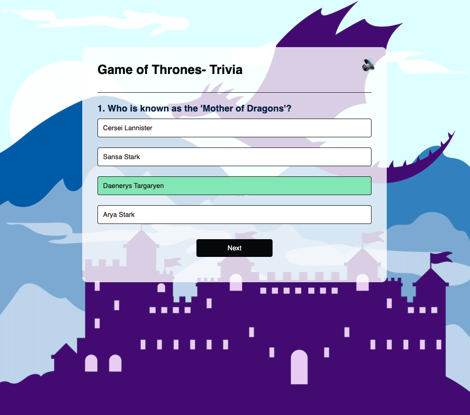

# Game-Of-Thrones-Trivia-App

Welcome to the **Game of Thrones Trivia Quiz App**! Test your knowledge of the world of Westeros with a series of fun and challenging questions from the iconic series.

## Features:
- A collection of trivia questions based on characters, events, and lore from **Game of Thrones**.
- A smooth and interactive user interface that makes the trivia experience even more immersive.
- Suitable to fit all device screens. Play at your desktop or mobile. 
- **Audio Feature**: The audio button located in the top right corner of the screen plays the legendary **Game of Thrones theme song**. 

## How to Play:
1. Answer the trivia questions to the best of your ability.
2. Keep track of your score as you progress through the quiz.
3. Challenge yourself and come back to test your knowledge again!

## How to Use the Audio Feature:
- Simply click the **audio button** in the top right corner of the app.
- The music will play in the background as you enjoy the quiz experience.

## Installation:

1. **Clone the repository** to your local machine:
   ```bash
   git clone https://github.com/yourusername/game-of-thrones-trivia-quiz.git




### Play Here:

[View a live demo here]([)](https://algomystique.github.io/Game-Of-Thrones-Trivia-App)

## **License:**

This project is licensed under the MIT License - see the LICENSE file for details.
